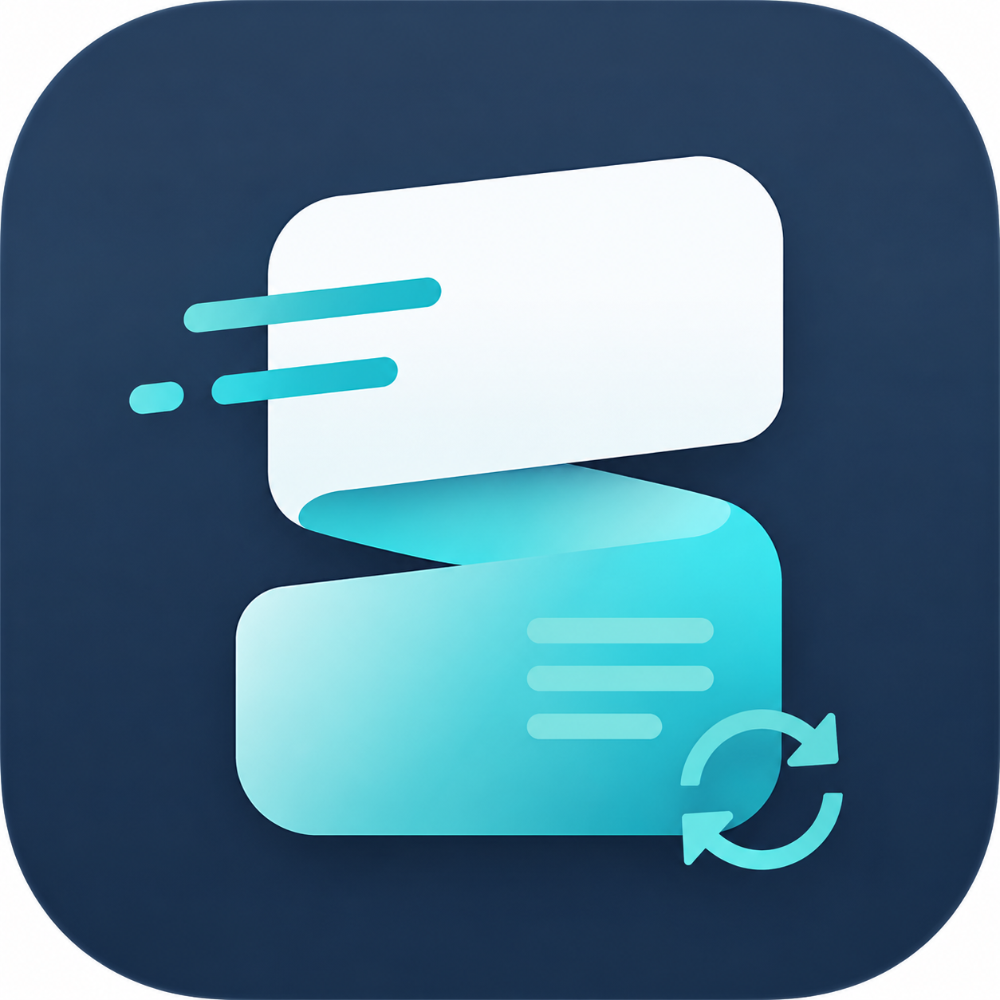

<p align="left">
  
  <b>Sipsip</b> · a fast, tidy, local-first clipboard workflow tool.
</p>

---

<div align="center">
  

  ### **STAY FAST. STAY TIDY.**

  [English](./README.md) | [简体中文](./README.zh-CN.md)
</div>

---

## Overview

Sipsip is a desktop clipboard manager built with Tauri, Rust, and React, designed for high-frequency daily work. All clipboard data is stored locally with fast search, tag organization, and convenient paste workflows. It provides Daily / Work mode isolation to keep temporary work content separate from your everyday clipboard.

## What's New in v1.0.3

### 🚀 Batch Deletion Performance

Previously, deleting by index range (e.g. `13-121`) issued per-item concurrent backend calls, each triggering a UI refresh — causing noticeable lag.

Now a **single batch call** `delete_clipboard_entries(ids)` handles deduplication, pinned-item skipping, per-entry mode-aware deletion, and emits only one `clipboard-changed` event. The frontend adds **80ms debounced merging** so dense event bursts trigger just one UI update.

### 🎯 Input Dialog Focus Fix

On Windows, clicking the index-range input previously caused a system alert sound and failed to accept keyboard input — the themed dialog wasn't properly acquiring Tauri window focus.

The fix coordinates `activate_window_focus` on auto-focus, mouse-down, and focus events, while blocking keydown propagation to global keyboard navigation, ensuring a smooth input experience.

### 🔒 Work Mode Isolation Hardening

The Daily / Work dual mode introduced in v1.0.0 is further hardened in v1.0.3:

- **Live event isolation**: `clipboard-updated` events carry `clipboard_mode` and are only inserted when matching the current mode.
- **Session history isolation**: Non-persistent `SessionHistory` is filtered by mode, preventing cross-mode cache pollution when persistence is disabled.
- **Deletion path isolation**: Work-mode deletes, clears, recent cleanup, post-paste deletion, and quota eviction all use the **no-tombstone** path — work content never leaks through cloud sync.
- **Remote deletion safety**: Cloud-sync remote deletions only affect Daily-mode records.

## v1.0.0 Core Features

### 📋 Daily / Work Modes

A segmented switch in the header toggles between modes:

- **Daily mode**: Regular clipboard history, eligible for cloud sync.
- **Work mode**: Isolated local content area, excluded from cloud sync by default. On leaving Work mode, you can keep or clear the work cache; cleanup does not write cloud-sync tombstones.

### 🏷️ Visible Index & Range Deletion

- Each clipboard record shows a **visible index badge** based on the current filtered, searched, and pinned-sorted display order.
- Delete by index range, e.g. `3-10` removes visible records 3 through 10.
- The input uses the app's themed dialog instead of the native browser prompt.
- Pinned records are protected during range deletion.

### ⏱️ Recent Time-Range Cleanup

One-click cleanup of clipboard records within a time window for the current mode:

- Clean last **1 hour**
- Clean last **24 hours**
- Refreshes the history list after cleanup; triggers cloud sync in Daily mode

### 🔍 Foundation

- Local-first clipboard history: text, rich text, images, and files
- Fast search, tag management, pinned items, and sequential paste workflows
- Optional LAN file transfer (Axum HTTP server + WebSocket)
- WebDAV / MQTT cross-device sync
- Privacy masking for sensitive previews
- Multiple polished desktop themes

## Local Development

```bash
npm install
npm run tauri:dev
```

Production web build:

```bash
npm run build
```

Desktop release build:

```bash
npm run tauri:build
```

On Windows with the current bundle configuration, the release executable is generated at:

```text
src-tauri/target/release/sipsip.exe
```

## Independent Release Setup

Before publishing this fork on your own GitHub, review:

- `.env.example`
- `src/shared/config/brand.ts`
- `src-tauri/tauri.conf.json`
- `docs/releases/v1.0.3.md`
- `docs/releases/v1.0.0.md`

Recommended release setup:

- Fill `VITE_APP_GITHUB_URL`, `VITE_APP_WEBSITE_URL`, and `VITE_FEEDBACK_EMAIL` in a local `.env`.
- Keep `VITE_ENABLE_UPDATER=false` until you have your own updater endpoint ready.
- Configure `VITE_ANNOUNCEMENT_PING_URL` and `VITE_THEME_STORE_API_BASE` only if you really need those remote services.
- Update Tauri bundle targets if you need platform installers beyond the current release executable.

## Notes

- This repo keeps compatibility cleanup for old `TieZ` installs and data folders so existing local data can migrate into Sipsip.
- Work mode is intended for temporary local material; pinned or tagged records are still protected by cleanup rules unless explicitly changed later.
- The planned snippet feature is intentionally not included in this release.

## Release History

| Version | Date | Highlights |
|---------|------|------------|
| v1.0.3 | 2026-06-19 | Batch deletion performance, input focus fix, work-mode isolation hardening |
| v1.0.0 | 2026-06-19 | First independent release: Daily/Work modes, index-range deletion, recent cleanup |

Detailed release notes are in the [`docs/releases/`](docs/releases/) directory.
